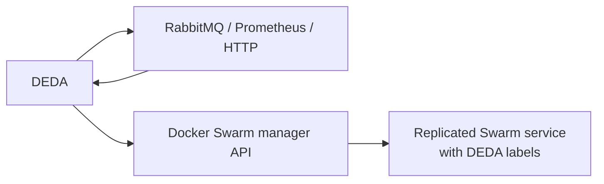

# DEDA — event-driven autoscaling for Docker Swarm

[](https://github.com/mikara89/deda/actions/workflows/ci.yml)
[](LICENSE)

DEDA is a KEDA-inspired autoscaler for Docker Swarm. It runs on a Swarm manager,
discovers replicated services that opt in through labels, reads one external
workload metric, and updates the service replica count.

Use DEDA when a Swarm workload should scale from queue depth, a Prometheus
query, or a small HTTP metric endpoint without moving the workload to
Kubernetes.

> **Project status:** pre-1.0 release-candidate development. DEDA includes
> production-readiness features, but operators should validate workload
> capacity, failure behavior, and upgrades in their own Swarm.

## Highlights

- Docker Swarm-native, label-driven autoscaling
- RabbitMQ, Prometheus, and HTTP triggers
- Scale-to-zero grace, scale-down stabilization, cooldown, and step limits
- Prometheus/OpenTelemetry metrics, structured logs, traces, and health checks
- Optional active/standby operation with a Redis TTL lease
- NativeAOT `linux/amd64` and `linux/arm64` images
- Docker CLI installation workflow and a pinned Docker socket-proxy template



## Five-minute start

Prerequisites: an active Linux Docker Swarm and access to a manager node.

```bash
git clone https://github.com/mikara89/deda.git
cd deda
docker network create --driver overlay deda_metrics
docker stack deploy -c examples/minimal/stack.yml deda
```

The minimal stack deploys DEDA behind a Docker socket proxy and publishes port
8080. Verify it after the first reconciliation:

```bash
curl --fail http://MANAGER_IP:8080/health/live
curl --fail http://MANAGER_IP:8080/health/ready
curl --fail http://MANAGER_IP:8080/metrics | head
```

Opt a replicated service into HTTP-based autoscaling by adding service labels
under `deploy.labels`:

```yaml
networks:
  deda_metrics:
    external: true

services:
  worker:
    image: example/orders-worker:1.0
    networks: [deda_metrics]
    deploy:
      replicas: 1
      labels:
        com.deda.autoscale.enabled: "true"
        com.deda.autoscale.min: "1"
        com.deda.autoscale.max: "20"
        com.deda.autoscale.targetPerReplica: "25"
        com.deda.autoscale.trigger.type: "http"
        com.deda.autoscale.trigger.url: "http://worker-metrics:8080/pending"
```

DEDA and the metric endpoint must be network-reachable. The
[getting-started guide](docs/getting-started.md) walks through installation,
verification, service evaluation, and next steps.

## Choose a trigger

| Trigger | Input | Typical use | Guide |
| --- | --- | --- | --- |
| RabbitMQ | Queue properties from the Management HTTP API | Queue consumers and task workers | [RabbitMQ](docs/triggers/rabbitmq.md) |
| Prometheus | One scalar or exactly one instant-vector series | Application/exporter metrics and rates | [Prometheus](docs/triggers/prometheus.md) |
| HTTP | One number from a GET response or JSON path | Small application-specific metric endpoints | [HTTP](docs/triggers/http.md) |

Successful values must be finite and non-negative. Empty Prometheus vectors
represent zero; ambiguous multi-series vectors are rejected. Trigger failures
use the service's `hold`, `min`, or `max` fail-safe policy.

## Documentation

DEDA documentation has a quick start, task-oriented guides, and full reference:

- [Documentation index](docs/README.md)
- [Getting started](docs/getting-started.md)
- [Labels and environment variables](docs/configuration.md)
- [Scaling and scale-to-zero](docs/scaling.md)
- [Observability](docs/observability.md)
- [Optional Redis HA](docs/high-availability.md)
- [Production deployment](docs/production.md)
- [Troubleshooting](docs/troubleshooting.md)
- [Runnable examples](examples/README.md)
- [Docker CLI plugin](src/tools/Docker.Deda.Cli/README.md)
- [Architecture decisions](docs/adr/README.md)

## Scaling in one minute

For active work, DEDA starts with:

```text
ceil(work / targetPerReplica)
```

It then applies absolute `min`/`max` bounds, scale-to-zero grace, cooldown,
recent-recommendation stabilization, per-cycle step limits, and a final safety
clamp. The exact implementation order and worked examples are in the
[scaling guide](docs/scaling.md).

`DEDA_POLL_SECONDS` is the authoritative global reconcile interval. The legacy
`com.deda.autoscale.pollSeconds` label is deprecated and ignored.

## Installation options

### Example stack

[`examples/minimal/stack.yml`](examples/minimal/stack.yml) is the clearest base
deployment. It uses a private overlay network and the pinned socket-proxy image.
Pin the DEDA image to a released version or digest for production.

### Docker CLI plugin

The NativeAOT `docker-deda` binary installs as a Docker CLI plugin and provides:

```bash
docker deda install
docker deda status
docker deda validate
docker deda upgrade --image ghcr.io/mikara89/deda:VERSION
docker deda uninstall
```

See the [plugin installation and command reference](src/tools/Docker.Deda.Cli/README.md).

## Health and observability

- `/health/live`: process and web host are running.
- `/health/ready`: the reconciliation infrastructure is healthy.
- `/metrics`: Prometheus text generated from `System.Diagnostics.Metrics`.

A healthy Redis standby is ready. Docker discovery or Redis lease-store failure
makes readiness unhealthy. Set `OTEL_EXPORTER_OTLP_ENDPOINT` to add standard
OTLP metric and trace export. See [observability](docs/observability.md).

## High availability

Run exactly one DEDA replica when Redis is not configured. For optional HA, run
two or more replicas with a shared `DEDA_REDIS_CONNECTION`; one lease owner
mutates Docker while standbys remain ready. Redis reduces split-brain risk, but
Docker Swarm has no fencing-token support. See the practical
[HA guide](docs/high-availability.md).

## Security

The Docker API can control the cluster. Prefer the supplied socket proxy over a
direct `/var/run/docker.sock` mount, keep its network private, and remember that
DEDA needs POST permission to update services. Use Docker secrets for RabbitMQ
credentials and never place passwords in service labels. See
[production deployment](docs/production.md) and [SECURITY.md](SECURITY.md).

## Repository layout

| Path | Purpose |
| --- | --- |
| `src/Deda.Core` | Domain models and ports |
| `src/Deda.Controller` | Reconciliation and health |
| `src/Deda.Swarm` | Docker Engine API client |
| `src/Deda.Config.Labels` | Service-label parser |
| `src/Deda.Triggers.*` | RabbitMQ, Prometheus, and HTTP adapters |
| `src/Deda.Policies` | Scaling policy |
| `src/Deda.HA` | Optional Redis leader lease |
| `src/Deda.Observability` | OpenTelemetry instrumentation |
| `src/tools/Docker.Deda.Cli` | Docker CLI plugin |
| `docs` | User guides and ADRs |
| `examples` | Deployable Swarm examples |

## Build and test

Requires the .NET 10 SDK:

```bash
dotnet restore Deda.sln
dotnet build Deda.sln --configuration Release
dotnet test Deda.sln --configuration Release
```

CI additionally verifies an actual single-node Swarm, NativeAOT container
building, coverage, CodeQL, and dependency review.

## Contributing and license

See [CONTRIBUTING.md](CONTRIBUTING.md). DEDA is licensed under the
[MIT License](LICENSE).
