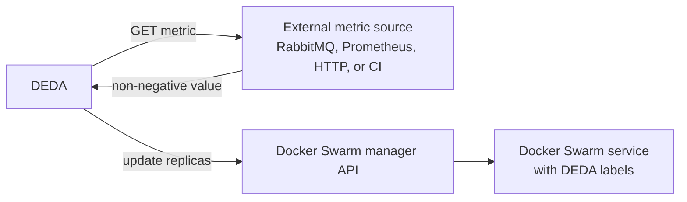

# Getting started

DEDA runs on a Docker Swarm manager. It discovers replicated services, reads
their `com.deda.autoscale.*` service labels, obtains one workload value from an
external metric source, and updates the Swarm service replica count.



## Prerequisites

- A Linux Docker Engine participating in an active Swarm.
- Access to a manager node or a Docker context targeting one.
- Network connectivity from DEDA to the Docker API and the chosen metric
  source.
- `curl` for the verification commands below.

Confirm the node is a manager:

```bash
docker info --format '{{.Swarm.LocalNodeState}} {{.Swarm.ControlAvailable}}'
```

If this is a local test machine and Swarm is inactive:

```bash
docker swarm init
```

## 1. Install DEDA

The quickest repository-based installation uses the socket-proxy stack. Clone
the repository on a manager and deploy the minimal example:

```bash
git clone https://github.com/mikara89/deda.git
cd deda
docker network create --driver overlay deda_metrics
docker stack deploy -c examples/minimal/stack.yml deda
```

The example defaults to the compatible pre-release
`ghcr.io/mikara89/deda:v0.1.0-preview.1`. Pin a final release or immutable
digest in production. The [Docker CLI plugin](../src/tools/Docker.Deda.Cli/README.md)
can render and deploy the same base topology with `docker deda install`.

DEDA can also use `/var/run/docker.sock` directly, but the socket grants broad
control of the manager. The supplied proxy pattern is preferred; see
[production deployment](production.md#docker-api-access).

## 2. Verify DEDA

Find a manager address reachable from your workstation, then check the three
HTTP surfaces:

```bash
export DEDA_ADDRESS=http://MANAGER_IP:8080
curl --fail "$DEDA_ADDRESS/health/live"
curl --fail "$DEDA_ADDRESS/health/ready"
curl --fail "$DEDA_ADDRESS/metrics" | head
```

- `/health/live` returns HTTP 200 when the process is running.
- `/health/ready` initially returns HTTP 503 until a reconciliation succeeds,
  then returns HTTP 200 while Docker and optional leader-election
  infrastructure remain healthy.
- `/metrics` returns Prometheus text exposition.

If readiness stays at 503, inspect the service and logs:

```bash
docker stack services deda
docker service ps deda_deda --no-trunc
docker service logs --tail 100 deda_deda
```

## 3. Opt one service into autoscaling

Labels belong under `deploy.labels`; container-level `labels` are not used for
Swarm service discovery. This example reads a plain number from an HTTP
endpoint:

```yaml
networks:
  deda_metrics:
    external: true

services:
  worker:
    image: example/orders-worker:1.0
    networks: [deda_metrics]
    deploy:
      replicas: 1
      labels:
        com.deda.autoscale.enabled: "true"
        com.deda.autoscale.min: "1"
        com.deda.autoscale.max: "10"
        com.deda.autoscale.targetPerReplica: "25"
        com.deda.autoscale.trigger.type: "http"
        com.deda.autoscale.trigger.url: "http://worker-metrics:8080/pending"
```

Deploy or update the application stack:

```bash
docker stack deploy -c application-stack.yml application
```

The service providing `worker-metrics` must also join the external
`deda_metrics` network. The worker itself only needs that network if it talks to
the metric service. DEDA and the metric endpoint must share a network or
otherwise be mutually reachable. See the trigger-specific guides for complete examples:

- [RabbitMQ](triggers/rabbitmq.md)
- [Prometheus](triggers/prometheus.md)
- [HTTP](triggers/http.md)

## 4. Verify evaluation and scaling

Wait at least one `DEDA_POLL_SECONDS` interval, then check logs and metrics:

```bash
docker service logs --since 2m deda_deda
curl --silent "$DEDA_ADDRESS/metrics" | grep 'deda_trigger_requests_total'
docker service inspect application_worker --format '{{json .Spec.Mode.Replicated.Replicas}}'
```

A successful evaluation logs a structured scale decision. If the desired count
differs from the current count, DEDA updates the Swarm service. A decision may
legitimately hold because of cooldown, stabilization, scale-to-zero grace, or
step limits; the [scaling guide](scaling.md) explains the order.

## Next steps

- Review every [configuration setting](configuration.md).
- Choose and configure a [trigger](README.md#task-oriented-guides).
- Read the [production checklist](production.md) before operating DEDA beyond a
  test Swarm.
