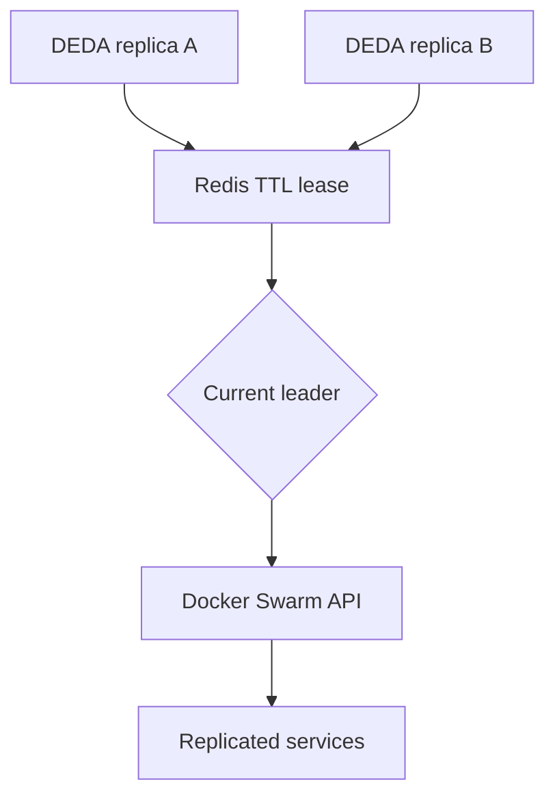

# Optional Redis high availability

High availability is optional.

- Base deployment: exactly one DEDA replica; Redis is not required.
- HA deployment: two or more DEDA replicas sharing one Redis leader lease.



Only the current leader discovers and mutates Docker services. A confirmed
standby skips reconciliation, reports ready, and retries the lease on the next
cycle/background renewal. Leadership is checked again immediately before every
replica update so a long metric call cannot blindly mutate after lease loss.

## Configuration

| Variable | Default | Allowed value | Purpose |
| --- | --- | --- | --- |
| `DEDA_REDIS_CONNECTION` | Disabled | StackExchange.Redis connection string | Enables Redis leader election. Example: `redis:6379,abortConnect=false`. |
| `DEDA_LEADER_LOCK_KEY` | `deda:leader` | Non-empty string | Key containing the current instance owner ID. Use a cluster-specific key when Redis is shared. |
| `DEDA_INSTANCE_ID` | Host name plus process ID | Non-empty unique string | Lease owner identity. Give every replica a distinct value. |
| `DEDA_LEADER_LEASE_SECONDS` | `30` | `5`–`300` | Lease TTL. |
| `DEDA_LEADER_RENEW_SECONDS` | `10` | `1`–`299` and less than lease | Background renewal interval. |

Out-of-range integer values are clamped first. Startup fails if the final renew
interval is not shorter than the final lease duration.

## Stack pattern

```yaml
services:
  redis:
    image: redis:7-alpine
    networks: [deda_control]
    command: ["redis-server", "--appendonly", "yes"]
    volumes:
      - redis_data:/data
    deploy:
      replicas: 1
      placement:
        constraints:
          - node.role == manager

  deda:
    image: ghcr.io/mikara89/deda:VERSION
    networks: [deda_control]
    environment:
      DOCKER_HOST: "http://docker-proxy:2375"
      DEDA_REDIS_CONNECTION: "redis:6379,abortConnect=false"
      DEDA_LEADER_LOCK_KEY: "orders-swarm:deda:leader"
      DEDA_LEADER_LEASE_SECONDS: "30"
      DEDA_LEADER_RENEW_SECONDS: "10"
    deploy:
      replicas: 2
      placement:
        constraints:
          - node.role == manager

volumes:
  redis_data:
```

The default instance ID is normally unique because Swarm tasks have distinct
host names and processes. Set `DEDA_INSTANCE_ID` only when your deployment can
guarantee a different value for every replica; a single static value shared by
all tasks defeats ownership checks.

See the complete [HA example](../examples/ha-redis/README.md).

## Failure behavior and limits

- Ownership mismatch is normal standby and remains ready.
- Redis transport/store failure disables mutation and makes readiness return
  HTTP 503. The reconciliation runner applies bounded backoff.
- Graceful shutdown deletes the key only if the instance still owns it.
- Crash recovery occurs after TTL expiry.
- Redis should be highly available and network-isolated when DEDA HA is relied
  upon.

The Redis lease reduces ordinary split-brain risk, but Docker Swarm's service
update API has no fencing-token field. DEDA cannot make arbitrary network
partitions perfectly linearizable. Keep lease timing conservative, monitor
Redis, and alert on readiness failures rather than treating the lease as a
substitute for operational controls.
