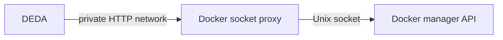

# Production deployment

DEDA is a pre-1.0 project with production-readiness features. Validate its
behavior against your workloads and failure modes before granting it control of
a production Swarm.

## Docker API access

Mounting `/var/run/docker.sock` exposes a powerful control-plane API. Even a
read-only filesystem mount does not make Docker API operations read-only; a
client that can reach the socket can request mutations.

Prefer the supplied `tecnativa/docker-socket-proxy` pattern:



The DEDA CLI template and repository examples pin the proxy image by digest.
They enable the service/task/node/Swarm/version endpoint families and `POST`
because DEDA must update replicated-service specifications. The proxy reduces
the exposed API surface; it is not read-only and remains privileged.

- Put DEDA and the proxy on a private overlay network.
- Do not publish the proxy port.
- Run the proxy on a manager and restrict who can update its service.
- Review proxy permissions and the pinned digest during upgrades.
- Treat direct socket access as an explicit higher-risk alternative.

## Replica count

- Without `DEDA_REDIS_CONNECTION`, run exactly one DEDA replica.
- With a shared Redis lease, run two or more replicas and monitor Redis and DEDA
  readiness.

Running multiple uncoordinated DEDA replicas can race service updates even
though Docker version-conflict retries reduce some conflicts.

## Secrets

- Never put passwords in service labels.
- Use Docker secrets and `RABBITMQ_USER_FILE` / `RABBITMQ_PASS_FILE` for a
  global RabbitMQ account.
- Use an operator-owned `trigger.credentialsRef` policy binding for a
  service-specific `username:password` secret and an allowed RabbitMQ host.
- `trigger.credentialsSecret` is legacy-only and disabled by default; enable it
  temporarily only with `DEDA_ALLOW_LEGACY_CREDENTIALS_SECRET=true` in a
  trusted cluster.
- Mount only required secrets on DEDA and use least-privilege metric-source
  accounts.

See [RabbitMQ credentials](triggers/rabbitmq.md#global-credentials).

## Resource starting point

The example stacks use these starting values:

```yaml
deploy:
  resources:
    limits:
      cpus: "0.25"
      memory: 256M
    reservations:
      cpus: "0.05"
      memory: 64M
```

These are examples, not guarantees. Service count, poll interval, metric
latency, TLS, telemetry export, and reconciliation errors all affect resource
use. Reconciliation evaluates at most `DEDA_MAX_CONCURRENT_SERVICES` services
at once and is cancelled after `DEDA_RECONCILE_TIMEOUT_SECONDS`; readiness also
expires when its last successful cycle exceeds its configured freshness age.
Observe CPU, memory, reconcile duration, and trigger duration under peak fleet
size before setting hard limits.

## Upgrade and restart behavior

DEDA keeps recommendation history, cooldown timestamps, and scale-to-zero
inactivity state in process memory. Restarting or upgrading DEDA clears them.

Consequences after restart:

- scale-down stabilization begins with new observations;
- cooldown history from a prior DEDA scale-up is lost;
- scale-to-zero requires a new continuous-inactivity window;
- current Docker replica counts remain authoritative and are rediscovered.

Use rolling updates deliberately. In HA mode, verify that the replacement
replica becomes ready and leadership remains stable.

## Network paths

Allow DEDA to reach only what it needs:

- the Docker manager API or private socket proxy;
- RabbitMQ Management API, Prometheus, or HTTP metric endpoints selected by
  services;
- Redis when HA is enabled;
- an OTLP collector when configured.

DEDA's own health and metrics port should be reachable by operators and the
monitoring system, not necessarily by public networks.

## Release and image policy

Pin a semantic version or immutable GHCR digest rather than `latest`. Release
images are multi-architecture. The release workflow scans immutable
architecture candidates, assembles and signs the verified manifest digest, and
only then publishes public release tags.

Validate signatures, checksums, SBOMs, and provenance according to your supply
chain policy. Test each upgrade in a representative Swarm and retain a rollback
image reference.

## Pre-deployment checklist

- [ ] Swarm manager placement is enforced.
- [ ] Docker proxy is private and permissions are reviewed.
- [ ] DEDA image is pinned.
- [ ] Replica count matches the Redis/HA choice.
- [ ] Metric endpoints and credentials use least privilege.
- [ ] Every service has measured `targetPerReplica`, bounded `min`/`max`, and an
      intentional fail-safe mode.
- [ ] Scale-to-zero workloads have a tested startup path and grace interval.
- [ ] Readiness and reconciliation failures alert operators.
- [ ] Restart/state-reset behavior has been tested.
