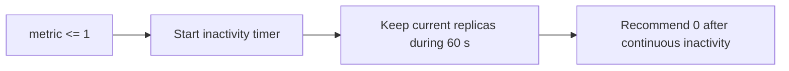

# Scaling behavior

DEDA evaluates each opted-in replicated service once per global reconciliation
cycle. For a valid workload value, the policy follows this order:

```mermaid
flowchart TD
    Metric[Valid finite, non-negative metric]
    Active{work <= activationThreshold?}
    Base[Recommend min]
    Ratio[ceil(work / targetPerReplica)]
    Bounds[Clamp to min and max]
    Zero[Apply scale-to-zero grace]
    History[Record recommendation]
    Cooldown{Downscale during cooldown?}
    Hold[Hold current replicas]
    Stabilize[Use highest recent recommendation]
    Step[Apply stepUp or stepDown]
    Final[Clamp to absolute min and max]

    Metric --> Active
    Active -->|yes| Base
    Active -->|no| Ratio
    Base --> Bounds
    Ratio --> Bounds
    Bounds --> Zero --> History --> Cooldown
    Cooldown -->|yes| Hold --> Step
    Cooldown -->|no| Stabilize --> Step
    Step --> Final
```

Trigger failure takes a separate path: reset scale-to-zero inactivity evidence,
choose the configured fail-safe target, and clamp it to `min`/`max`. Cooldown,
stabilization, and step limits are not applied to that failure decision.

## A. Normal scale-up

Configuration: `min=1`, `max=20`, `targetPerReplica=10`. Current replicas: 2.
Metric: 75.

```text
ceil(75 / 10) = 8
```

With the default `stepUp=10`, DEDA can move directly from 2 to 8. With
`stepUp=3`, the immediate result is 5 and later reconciliations can continue
toward 8 if the metric remains high.

## B. Proportional downscale

Current replicas: 10. Metric: 50. `targetPerReplica=10`.

```text
ceil(50 / 10) = 5
```

If `scaleDownDelaySeconds=120`, DEDA compares 5 with all still-valid recent
recommendations and retains the highest. A recent recommendation of 10 can
therefore hold the service at 10 until it expires. `stepDown` is applied after
this stabilization result.

## C. Activation threshold

With `min=1`, `activationThreshold=2`, and metric 1, DEDA recommends `min=1`.
The threshold only identifies inactive or near-zero work. For example, metric
50 with `targetPerReplica=10` still recommends 5 even if the current count is
10; activation does not block proportional downscale.

## D. Scale to zero

With `min=0`, `activationThreshold=1`, and
`scaleToZeroGraceSeconds=60`:



Active work resets the timer. A trigger failure also resets it because an
unknown workload is not evidence of continuous inactivity. The next valid
inactive observation begins a new 60-second window.

An explicit `failsafe=min` with `min=0` is different: it intentionally selects
zero immediately on trigger failure. Scale-to-zero grace does not override that
failure policy.

Cooldown and recommendation stabilization still run after the grace period and
may delay the actual zero recommendation further.

## E. Step limits

With `current=2`, calculated desired count 12, and `stepUp=3`:

```text
2 -> 5 -> 8 -> 11 -> 12
```

Each arrow is a later successful reconciliation with demand still supporting
12. `stepDown` behaves similarly in the opposite direction. A value of `0`
means unlimited movement for that direction.

Absolute bounds win over gradual limits when an external actor places the
service outside the configured range. If `max=20` but the service currently has
25 replicas, the final clamp can return it directly to 20 even when
`stepDown=1`.

## State and restarts

Recommendation history, last scale timestamps, and scale-to-zero inactivity
timestamps are held in DEDA memory. Restarting DEDA clears them. After a
restart, downscale stabilization starts with new observations and a service
must build a fresh continuous-inactivity window before scale-to-zero.
