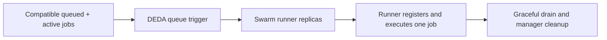

# Autoscaled CI runners

These references run one self-hosted CI job per Swarm task where the provider supports it. DEDA observes compatible **queued + active** work, calculates a replica count, and scales only the runner service. Registration, draining, removal, and job cleanup stay in the runner image.



| Provider | Reference | Queue observer credential | Runner credential | Default executor |
| --- | --- | --- | --- | --- |
| GitHub Actions | [GitHub Actions](github-actions/README.md) | `github-queue-reader` | `github-runner-admin` | Actions runner process |
| Azure Pipelines | [Azure Pipelines](azure-pipelines/README.md) | `ado-queue-reader` | `ado-agent-registration` | Azure agent process |
| GitLab CI | [GitLab CI](gitlab/README.md) | `gitlab-queue-reader` | `gitlab-runner-auth` | Shell, concurrency one |

Create the named secrets before deployment. The example policy files are Docker configs, not secrets: they name secrets and restrict their use but contain no token values. Build and publish the runner image (or set the documented `*_RUNNER_IMAGE` value) before `docker stack deploy`.

All examples use `min=0`, `targetPerReplica=1`, conservative cooldown and delay settings, `failsafe=hold`, and a 30 minute `stop_grace_period`. They intentionally use ordinary shell/tooling jobs; no runner has a Docker socket, Docker API access, privileged mode, or provider token injected into a job definition. Docker-in-Docker or a host socket is a separate, high-risk design and is not included here.

DEDA caches provider observations for `refreshSeconds`; its CI metrics expose API request volume, queue/active counts, capacity, and observation age. Retain Swarm task stdout/stderr centrally: GitHub specifically recommends external preservation of ephemeral-runner logs.

Run local deterministic wrapper checks with:

```bash
bash tests/ci-runners/lifecycle-tests.sh
```

They do not contact CI providers or require secrets.
