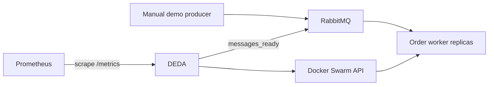

# Order-processing topology

This example combines a RabbitMQ queue, a DEDA-scaled worker service,
per-service Docker-secret credentials, and Prometheus scraping of DEDA.



The worker image sleeps instead of processing orders. That keeps the example
self-contained and makes backlog-driven scaling observable; replace it with a
real consumer to validate throughput and downscale under production-like load.

## Prerequisites

- Active Linux Docker Swarm
- Manager-node Docker context
- Ports 8085, 9092, and 15675 available

Create the per-service credential secret expected by DEDA:

```bash
printf '%s' 'demo-orders:demo-password-change-me' \
  | docker secret create orders-rabbitmq -
```

These are disposable demo values matching the isolated RabbitMQ container.

## Deploy

Deploy the stack. Swarm distributes `prometheus.yml` as a Docker config:

```bash
cd examples/order-processing
docker stack deploy -c stack.yml orders-demo
```

After RabbitMQ starts, declare the queue:

```bash
curl --user demo-orders:demo-password-change-me \
  --request PUT \
  --header 'content-type: application/json' \
  --data '{"auto_delete":false,"durable":true,"arguments":{}}' \
  http://MANAGER_IP:15675/api/queues/%2F/orders
```

Publish 250 demo orders:

```bash
for i in $(seq 1 250); do
  curl --silent --user demo-orders:demo-password-change-me \
    --request POST \
    --header 'content-type: application/json' \
    --data '{"properties":{},"routing_key":"orders","payload":"{\"orderId\":\"demo\"}","payload_encoding":"string"}' \
    http://MANAGER_IP:15675/api/exchanges/%2F/amq.default/publish >/dev/null
done
```

## Expected behavior

The service is bounded at 1–20 replicas. A 250-message backlog recommends 10
replicas. `stepUp=5` moves from 1 to 6, then to 10 on a later cycle. When a real
worker drains the queue, `scaleDownDelaySeconds=60` retains recent higher
recommendations and `stepDown=2` makes removal gradual.

```bash
docker service logs --since 5m orders-demo_deda
docker service inspect orders-demo_order-worker \
  --format '{{.Spec.Mode.Replicated.Replicas}}'
curl --fail http://MANAGER_IP:8085/health/ready
curl --get http://MANAGER_IP:9092/api/v1/query \
  --data-urlencode 'query=deda_desired_replicas{service="orders-demo_order-worker"}'
```

Prometheus scrapes DEDA, not RabbitMQ. Add a RabbitMQ exporter if queue metrics
also need dashboards.

## Clean up

```bash
docker stack rm orders-demo
docker secret rm orders-rabbitmq
```

The RabbitMQ volume remains until explicitly removed. Review the canonical
[RabbitMQ](../../docs/triggers/rabbitmq.md), [scaling](../../docs/scaling.md),
[observability](../../docs/observability.md), and
[production](../../docs/production.md) guides before adapting the topology.
